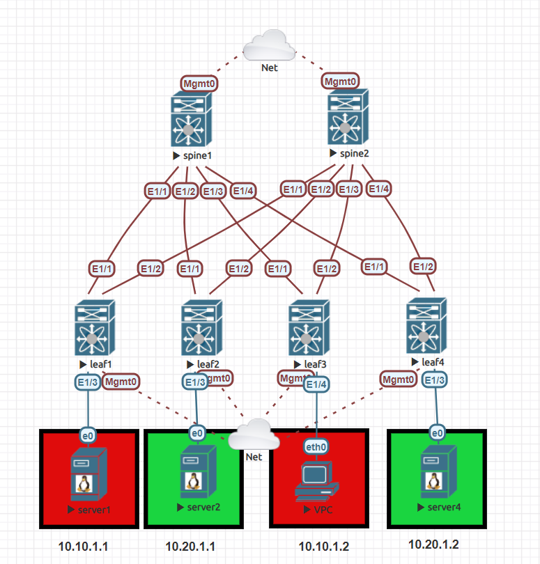

# Ansible NXOS Spine Leaf Infrastructure



## Purpose

This repo is based on a great post by [Rick Donato](https://www.packetflow.co.uk/how-to-build-a-nxos-9000v-based-evpn-vxlan-fabric/). I wanted to see if I could automate this guide using Ansible. Ansible is a popular configuration management framework that probably doesn't need much more of an introduction. In the repo you will see a decent amount of use cases. Whether thats using built in modules for specific tasks, jinja templating (building configurations), conditionals, and variable placements.

## Prerequisites

1. Ansible =< 2.9
2. NXOSv 9K Version 9.2.4
3. Validate Ansible control machine has access to nodes

## Project Structure

```
juliopdx@librenms:~/repos$ tree nxos_spine_leaf/
nxos_spine_leaf/
├── ansible.cfg
├── deploy.yaml
├── group_vars
│   ├── leafs.yaml
│   ├── network.yaml
│   └── spines.yaml
├── hosts
├── host_vars
│   ├── leaf1.yaml
│   ├── leaf2.yaml
│   ├── leaf3.yaml
│   ├── leaf4.yaml
│   ├── spine1.yaml
│   └── spine2.yaml
├── images
│   └── spine_leaf.PNG
├── readme.md
└── roles
    ├── base
    │   └── tasks
    │       └── main.yaml
    ├── bgp
    │   ├── files
    │   ├── tasks
    │   │   └── main.yaml
    │   └── templates
    │       └── bgp.j2
    ├── enhancements
    │   └── tasks
    │       └── main.yaml
    ├── features
    │   └── tasks
    │       └── main.yaml
    ├── interfaces
    │   └── tasks
    │       └── main.yaml
    ├── ospf
    │   └── tasks
    │       └── main.yaml
    ├── pim
    │   └── tasks
    │       └── main.yaml
    └── vlan_vxlan
        ├── files
        ├── tasks
        │   └── main.yaml
        └── templates
            └── vlan_vxlan.j2
```

Each host has an individual file under the `host_vars` folder and each group has an individual file under the `group_vars` folder. This is again for organization. If a variable is used throughout all devices, then it will be placed in `network.yaml` file. If a variable is specific to the leafs then it will be placed in the `leafs.yaml` file. lastly, if a variable is host specific, it will be under the `host_vars` folder for each host.

### `hosts`

I tried to make the hosts file as basic as possible, grouping together nodes where it made sense to me.

```
locahost

[network]
spine1 ansible_host=192.168.10.83
spine2 ansible_host=192.168.10.84
leaf1 ansible_host=192.168.10.90
leaf2 ansible_host=192.168.10.86
leaf3 ansible_host=192.168.10.87
leaf4 ansible_host=192.168.10.88

[network:vars]
ansible_user=cisco
ansible_ssh_pass=cisco
ansible_network_os=nxos

[spines]
spine1
spine2

[leafs]
leaf1
leaf2
leaf3
leaf4
```

Not much to look at in the ansible.cfg file, these are just normal settings with some timers set to account for any latency. After the hosts file and config file are created, we can get started on the fun stuff. 

### `deploy.yaml`

This file will kick off each role listed. Roles are broken out by function, again going with what made sense to me. These could probably be split off even more for organization. 

```yaml
---
- name: Deploying Infrastructure
  connection: network_cli
  gather_facts: false
  hosts: network
  roles:
    - base
    - features
    - interfaces
    - ospf
    - pim
    - bgp
    - enhancements
    - vlan_vxlan
```

### `roles/base/tasks/main.yaml`

My original thought with this repo was to use as many native nxos modules that come with Ansible. For example, if there was a module only to configure a hostname for nxos devices then I would use that. Eventually I found it easier and more flexible to just make a jinja template and run with the nxos_config module. More on that later.

```yaml
- name: configure necessities
  nxos_config:
    lines:
      - hostname {{ hostname }}
      - cli alias name wr copy run start
    save_when: modified
  when: hostname is defined

--snipp--
```

You will notice this is the first time you see a variable that wil be populated, `hostname {{  hostname }}`. Since this is device specific, here is a snip from `leaf1.yaml`.

```yaml
hostname: leaf1

interfaces:

  Ethernet1/1:
    name: Ethernet1/1
    enabled: True
    mode: layer3
    mtu: 9216
    description: connection to spine1
    ospf_enabled: True
    pim: True

--snipp--
```

When that task is run against leaf1, the final output will be `hostname leaf1` ... 

### `roles/features/tasks/main.yaml`

```yaml
- name: enable features for fabric
  nxos_feature:
    feature: "{{ item }}"
    state: enabled
  loop: "{{ features }}"
  when: features is defined

- name: enable additional features without using nxos_feature module
  nxos_config:
    lines: ['feature fabric forwarding', 'nv overlay evpn']
```

This file is a pretty cool example on how to solve the same task in two different ways. The first task uses the `nxos_feature` module and loops over the `features` variable. Since all features are the same for each node, they are located under `group_vars/network.yaml`. The second option uses the `nxos_config` module and we pass in a list.

```yaml
ospf_instance: OSPF_UNDERLAY_NET

features:
  - ospf
  - pim
  - bgp
  - interface-vlan
  - vn-segment-vlan-based
  - nv overlay

--snipp--
```

### `roles/interfaces/tasks/main.yaml`

```yaml
- name: configure ethernet interface settings
  nxos_interfaces:
    config:
      - name: "{{ item.value.name }}"
        description: "{{ item.value.description }}"
        enabled: "{{ item.value.enabled }}"
        mtu: "{{ item.value.mtu }}"
        mode: "{{ item.value.mode }}"
  with_dict: "{{ interfaces }}"
  when: interfaces is defined

--snipp--
```

As you can see this is usable but a bit messy. In this case we are looping over a dict that we've defined as `interfaces` for each host. Remember the `leaf1.yaml` snip shown earlier.

### `roles/ospf/tasks/main.yaml`

```yaml
--snip--
- name: enabling ospf on interfaces
  nxos_config:
    lines:
      - medium p2p
      - ip unnumbered loopback0
      - ip router ospf {{ ospf_instance }} area 0.0.0.0
    parents: interface {{ item.value.name }}
  with_dict: "{{ interfaces }}"
  when: interfaces is defined and item.value.ospf_enabled == True

- name: enabling ospf on loopbacks
  nxos_interface_ospf:
    interface: "{{ item.value.name }}"
    ospf: "{{ ospf_instance }}"
    area: '0.0.0.0'
  with_dict: "{{ loopbacks }}"
  when: loopbacks is defined and item.value.ospf_enabled == True
```

Similar to before, two different approaches to enable OSPF on an interface. Ill move into the bgp and vlan_vxlan roles as they both utilize jinja templates.

### `roles/bgp/tasks/main.yaml`

```yaml
- name: generate bgp configurations
  template:
    src: ./roles/bgp/templates/bgp.j2
    dest: ./roles/bgp/files/{{ hostname }}.cfg
  delegate_to: localhost

- name: configure bgp
  nxos_config:
    src: ./roles/bgp/files/{{ hostname }}.cfg
```

Nothing crazy here, we are asking the local Ansible control machine to generate configuration files and then using that file with the `nxos_config` module to send the configuration. Ill include a small section of the `bgp.j2` template used to build the configuration file.

```jinja
router bgp {{ bgp.asn }}
  log-neighbor-changes
  address-family ipv4 unicast
  address-family l2vpn evpn

    retain route-target all

  template peer VXLAN
    remote-as 64520
    update-source loopback0
    address-family ipv4 unicast
      send-community extended

      route-reflector-client


--snip--
```

### `roles/enhancements/tasks/main.yaml`

```yaml
- name: configure fabric enhancements
  nxos_config:
    lines:
      - fabric forwarding anycast-gateway-mac 0000.0011.1234
      - hardware access-list tcam region vpc-convergence 0
      - hardware access-list tcam region span 0
      - hardware access-list tcam region rp-ipv6-qos 0
      - hardware access-list tcam region rp-mac-qos 0
      - hardware access-list tcam region arp-ether 256 double-wide
    save_when: modified
  when: "'leafs' in group_names"
  register: enhancements
# Thanks to Brian Mitchell in the comments for pointing out double-wide requirement

- name: reboot switches for enhancements to take effect
  nxos_reboot:
    confirm: true
  when: enhancements.changed == 'true'
  ignore_errors: yes

- name: Wait 10 minutes for ssh to come back up
  wait_for:
    timeout: 600
    delay: 120
    sleep: 10
    host: "{{ ansible_host }}"
    port: 22
  delegate_to: localhost
  when: enhancements.changed == 'true'
```

I faced a similar issue as a fellow reader, I needed to lower more TCAM resources for arp suppression to work. Once the first task is executed the rest of the playbook deals with rebooting the switch for changes to take effect and become available again.

### `roles/vlan_vxlan/tasks/main.yaml`

```yaml
- name: generate vlan/vni/evpn configurations
  template:
    src: ./roles/vlan_vxlan/templates/vlan_vxlan.j2
    dest: ./roles/vlan_vxlan/files/{{ hostname }}.cfg
  delegate_to: localhost
  when: "'leafs' in group_names"

- name: configure vlan/vni/evpn
  nxos_config:
    src: ./roles/vlan_vxlan/files/{{ hostname }}.cfg
  when: "'leafs' in group_names"
```

Same thought as before with the bgp role. Local Ansible to generate configurations and then send. One neat wrinkle here is that these configuration only apply to leafs. So we use a conditional statement to only run on nodes in the leafs group. Here's a small snip of the `vlan_vxlan.j2` template. 

```jinja

vlan {{ vlan.id }}
  name {{ vlan.description }}

  shutdown


  vn-segment {{ vlan.vn_segment }}





vrf context {{ vrf.name }}

  vni {{ vrf.vn_segment }}

  rd {{ vrf.rd }}

  {{ vrf.address_family }}
    route-target both auto
    route-target both auto evpn






--snip--
```

## Running Playbook

```
juliopdx@librenms:~/repos/nxos_spine_leaf$ ansible-playbook deploy.yaml 

PLAY [Deploying Infrastructure] ****************************************************************************************************************************************

TASK [base : configure necessities] ************************************************************************************************************************************
changed: [leaf4]
changed: [spine2]

TASK [base : configure motd banner] ************************************************************************************************************************************
ok: [spine2]
ok: [leaf4]

TASK [base : configure exec banner] ************************************************************************************************************************************
ok: [leaf4]
ok: [spine2]

TASK [features : enable features for fabric] ***************************************************************************************************************************
ok: [spine2] => (item=ospf)
ok: [leaf4] => (item=ospf)
ok: [spine2] => (item=pim)
ok: [leaf4] => (item=pim)
ok: [leaf4] => (item=bgp)
ok: [spine2] => (item=bgp)
ok: [leaf4] => (item=interface-vlan)
ok: [spine2] => (item=interface-vlan)
ok: [spine2] => (item=vn-segment-vlan-based)
ok: [spine2] => (item=nv overlay)
ok: [leaf4] => (item=vn-segment-vlan-based)
ok: [leaf4] => (item=nv overlay)

TASK [features : enable additional features without using nxos_feature module] *****************************************************************************************
ok: [leaf4]
ok: [spine2]

TASK [interfaces : configure ethernet interface settings] **************************************************************************************************************
ok: [leaf4] => (item={'key': 'Ethernet1/1', 'value': {'name': 'Ethernet1/1', 'enabled': True, 'mode': 'layer3', 'mtu': 9216, 'description': 'connection to spine1', 'ospf_enabled': True, 'pim': True}})
ok: [leaf4] => (item={'key': 'Ethernet1/2', 'value': {'name': 'Ethernet1/2', 'enabled': True, 'mode': 'layer3', 'mtu': 9216, 'description': 'connection to spine2', 'ospf_enabled': True, 'pim': True}})
ok: [spine2] => (item={'key': 'Ethernet1/1', 'value': {'name': 'Ethernet1/1', 'enabled': True, 'mode': 'layer3', 'mtu': 9216, 'description': 'connection to leaf1', 'ospf_enabled': True, 'pim': True}})
ok: [leaf4] => (item={'key': 'Ethernet1/3', 'value': {'name': 'Ethernet1/3', 'enabled': True, 'mode': 'layer2', 'vlan': 20, 'mtu': 9216, 'description': 'connection to server4', 'ospf_enabled': False, 'pim': False}})
ok: [spine2] => (item={'key': 'Ethernet1/2', 'value': {'name': 'Ethernet1/2', 'enabled': True, 'mode': 'layer3', 'mtu': 9216, 'description': 'connection to leaf2', 'ospf_enabled': True, 'pim': True}})
ok: [spine2] => (item={'key': 'Ethernet1/3', 'value': {'name': 'Ethernet1/3', 'enabled': True, 'mode': 'layer3', 'mtu': 9216, 'description': 'connection to leaf3', 'ospf_enabled': True, 'pim': True}})
ok: [spine2] => (item={'key': 'Ethernet1/4', 'value': {'name': 'Ethernet1/4', 'enabled': True, 'mode': 'layer3', 'mtu': 9216, 'description': 'connection to leaf4', 'ospf_enabled': True, 'pim': True}})

TASK [interfaces : configure loopback interface settings] **************************************************************************************************************
ok: [spine2] => (item={'key': 'loopback0', 'value': {'name': 'loopback0', 'ip_address': '192.168.0.2/32', 'description': 'loopback 0', 'ospf_enabled': True, 'pim': True}})
ok: [spine2] => (item={'key': 'loopback1', 'value': {'name': 'loopback1', 'ip_address': '1.2.3.4/32', 'description': 'loopback 0', 'ospf_enabled': True, 'pim': True}})
ok: [leaf4] => (item={'key': 'loopback0', 'value': {'name': 'loopback0', 'ip_address': '192.168.0.6/32', 'description': 'loopback 0', 'ospf_enabled': True, 'pim': True}})

TASK [interfaces : configure nve interfaces] ***************************************************************************************************************************
skipping: [spine2]
ok: [leaf4]

TASK [ospf : creating OSPF instance] ***********************************************************************************************************************************
ok: [leaf4]
ok: [spine2]

TASK [ospf : enabling ospf on interfaces] ******************************************************************************************************************************
ok: [leaf4] => (item={'key': 'Ethernet1/1', 'value': {'name': 'Ethernet1/1', 'enabled': True, 'mode': 'layer3', 'mtu': 9216, 'description': 'connection to spine1', 'ospf_enabled': True, 'pim': True}})
ok: [spine2] => (item={'key': 'Ethernet1/1', 'value': {'name': 'Ethernet1/1', 'enabled': True, 'mode': 'layer3', 'mtu': 9216, 'description': 'connection to leaf1', 'ospf_enabled': True, 'pim': True}})
ok: [spine2] => (item={'key': 'Ethernet1/2', 'value': {'name': 'Ethernet1/2', 'enabled': True, 'mode': 'layer3', 'mtu': 9216, 'description': 'connection to leaf2', 'ospf_enabled': True, 'pim': True}})
ok: [leaf4] => (item={'key': 'Ethernet1/2', 'value': {'name': 'Ethernet1/2', 'enabled': True, 'mode': 'layer3', 'mtu': 9216, 'description': 'connection to spine2', 'ospf_enabled': True, 'pim': True}})
skipping: [leaf4] => (item={'key': 'Ethernet1/3', 'value': {'name': 'Ethernet1/3', 'enabled': True, 'mode': 'layer2', 'vlan': 20, 'mtu': 9216, 'description': 'connection to server4', 'ospf_enabled': False, 'pim': False}}) 
ok: [spine2] => (item={'key': 'Ethernet1/3', 'value': {'name': 'Ethernet1/3', 'enabled': True, 'mode': 'layer3', 'mtu': 9216, 'description': 'connection to leaf3', 'ospf_enabled': True, 'pim': True}})
ok: [spine2] => (item={'key': 'Ethernet1/4', 'value': {'name': 'Ethernet1/4', 'enabled': True, 'mode': 'layer3', 'mtu': 9216, 'description': 'connection to leaf4', 'ospf_enabled': True, 'pim': True}})

TASK [ospf : enabling ospf on loopbacks] *******************************************************************************************************************************
ok: [spine2] => (item={'key': 'loopback0', 'value': {'name': 'loopback0', 'ip_address': '192.168.0.2/32', 'description': 'loopback 0', 'ospf_enabled': True, 'pim': True}})
ok: [leaf4] => (item={'key': 'loopback0', 'value': {'name': 'loopback0', 'ip_address': '192.168.0.6/32', 'description': 'loopback 0', 'ospf_enabled': True, 'pim': True}})
ok: [spine2] => (item={'key': 'loopback1', 'value': {'name': 'loopback1', 'ip_address': '1.2.3.4/32', 'description': 'loopback 0', 'ospf_enabled': True, 'pim': True}})

TASK [pim : configure pim rp-address and group-list] *******************************************************************************************************************
changed: [spine2]
changed: [leaf4]

TASK [pim : configure ssm range] ***************************************************************************************************************************************
changed: [leaf4]
changed: [spine2]

TASK [pim : configure rp/anycast-rp set] *******************************************************************************************************************************
skipping: [leaf4] => (item=192.168.0.1) 
skipping: [leaf4] => (item=192.168.0.2) 
ok: [spine2] => (item=192.168.0.1)
ok: [spine2] => (item=192.168.0.2)

TASK [pim : enable pim sparse mode on interfaces] **********************************************************************************************************************
ok: [spine2] => (item={'key': 'Ethernet1/1', 'value': {'name': 'Ethernet1/1', 'enabled': True, 'mode': 'layer3', 'mtu': 9216, 'description': 'connection to leaf1', 'ospf_enabled': True, 'pim': True}})
ok: [leaf4] => (item={'key': 'Ethernet1/1', 'value': {'name': 'Ethernet1/1', 'enabled': True, 'mode': 'layer3', 'mtu': 9216, 'description': 'connection to spine1', 'ospf_enabled': True, 'pim': True}})
ok: [leaf4] => (item={'key': 'Ethernet1/2', 'value': {'name': 'Ethernet1/2', 'enabled': True, 'mode': 'layer3', 'mtu': 9216, 'description': 'connection to spine2', 'ospf_enabled': True, 'pim': True}})
skipping: [leaf4] => (item={'key': 'Ethernet1/3', 'value': {'name': 'Ethernet1/3', 'enabled': True, 'mode': 'layer2', 'vlan': 20, 'mtu': 9216, 'description': 'connection to server4', 'ospf_enabled': False, 'pim': False}}) 
ok: [spine2] => (item={'key': 'Ethernet1/2', 'value': {'name': 'Ethernet1/2', 'enabled': True, 'mode': 'layer3', 'mtu': 9216, 'description': 'connection to leaf2', 'ospf_enabled': True, 'pim': True}})
ok: [spine2] => (item={'key': 'Ethernet1/3', 'value': {'name': 'Ethernet1/3', 'enabled': True, 'mode': 'layer3', 'mtu': 9216, 'description': 'connection to leaf3', 'ospf_enabled': True, 'pim': True}})
ok: [spine2] => (item={'key': 'Ethernet1/4', 'value': {'name': 'Ethernet1/4', 'enabled': True, 'mode': 'layer3', 'mtu': 9216, 'description': 'connection to leaf4', 'ospf_enabled': True, 'pim': True}})

TASK [pim : enable pim sparse mode on loopbacks] ***********************************************************************************************************************
ok: [spine2] => (item={'key': 'loopback0', 'value': {'name': 'loopback0', 'ip_address': '192.168.0.2/32', 'description': 'loopback 0', 'ospf_enabled': True, 'pim': True}})
ok: [spine2] => (item={'key': 'loopback1', 'value': {'name': 'loopback1', 'ip_address': '1.2.3.4/32', 'description': 'loopback 0', 'ospf_enabled': True, 'pim': True}})
ok: [leaf4] => (item={'key': 'loopback0', 'value': {'name': 'loopback0', 'ip_address': '192.168.0.6/32', 'description': 'loopback 0', 'ospf_enabled': True, 'pim': True}})

TASK [bgp : generate bgp configurations] *******************************************************************************************************************************
ok: [leaf4 -> localhost]
ok: [spine2 -> localhost]

TASK [bgp : configure bgp] *********************************************************************************************************************************************
ok: [spine2]
ok: [leaf4]

TASK [vlan_vxlan : generate vlan/vni/evpn configurations] **************************************************************************************************************
skipping: [spine2]
ok: [leaf4 -> localhost]

TASK [vlan_vxlan : configure vlan/vni/evpn] ****************************************************************************************************************************
skipping: [spine2]
changed: [leaf4]

PLAY RECAP *************************************************************************************************************************************************************
leaf4                      : ok=19   changed=4    unreachable=0    failed=0    skipped=1    rescued=0    ignored=0   
spine2                     : ok=17   changed=3    unreachable=0    failed=0    skipped=3    rescued=0    ignored=0   

juliopdx@librenms:~/repos/nxos_spine_leaf$

```

### `roles/test/tasks/main.yaml`

```yaml
# This task is using the bgp.neighbors variable in group_vars 
# to loop over loopback addresses and test basic reachability.
- name: testing node to node reachability
  net_ping:
    dest: "{{ item }}"
    source: "{{ loopbacks.loopback0.ip_address | ipv4('address') }}"
    count: 1
  loop: "{{ bgp.neighbors }}"
  register: pings

# This one was a bit interesting, since running a trace has a header,
# I am comparing the length to 2. Since the header is one and the first
# hop is the second. We expect each trace to only be one hop away.
- name: run traceroutes to gather expected number of hops
  nxos_command:
    commands: traceroute {{ item }}
  loop: "{{ bgp.neighbors }}"
  register: traces
  failed_when: "{{ traces.stdout_lines.0 | length }} > 2"

- name: run show command to view bgp neighbors
  nxos_command:
    commands: show bgp vrf all all neighbors | inc Established
  register: bgp_neighbors

# Similar idea here, since we are using the | include syntax there is no
# header and we can do an exact comparison. Spines should all have four neighbors
# and leafs should all have two neighbors.

- name: BGP validation check
  assert:
    that:
      - "{{ bgp_neighbors.stdout_lines.0 | length }} == {{ bgp.neighbors | length }}"
    fail_msg: "{{ inventory_hostname }} has missing BGP neighbors"
    success_msg: "{{ inventory_hostname }} has passed BGP checks"
```

### Running validation on one spine and leaf

```bash
juliopdx@librenms:~/repos/nxos_spine_leaf$ ansible-playbook test.yaml 

PLAY [Deploying Infrastructure] ****************************************************************************************************************************************

TASK [test : testing node to node reachability] ************************************************************************************************************************
ok: [leaf1] => (item=192.168.0.1)
ok: [spine1] => (item=192.168.0.3)
ok: [spine1] => (item=192.168.0.4)
ok: [leaf1] => (item=192.168.0.2)
ok: [spine1] => (item=192.168.0.5)
ok: [spine1] => (item=192.168.0.6)

TASK [test : run traceroutes to gather expected number of hops] ********************************************************************************************************
[WARNING]: conditional statements should not include jinja2 templating delimiters such as {{ }} or . Found: {{ traces.stdout_lines.0 | length }} > 2
ok: [spine1] => (item=192.168.0.3)
[WARNING]: conditional statements should not include jinja2 templating delimiters such as {{ }} or . Found: {{ traces.stdout_lines.0 | length }} > 2
ok: [leaf1] => (item=192.168.0.1)
ok: [leaf1] => (item=192.168.0.2)
ok: [spine1] => (item=192.168.0.4)
ok: [spine1] => (item=192.168.0.5)
ok: [spine1] => (item=192.168.0.6)

TASK [test : run show command to view bgp neighbors] *******************************************************************************************************************
ok: [leaf1]
ok: [spine1]

TASK [test : BGP validation check] *************************************************************************************************************************************
ok: [leaf1] => {
    "changed": false,
    "msg": "leaf1 has passed BGP checks"
}
ok: [spine1] => {
    "changed": false,
    "msg": "spine1 has passed BGP checks"
}

PLAY RECAP *************************************************************************************************************************************************************
leaf1                      : ok=4    changed=0    unreachable=0    failed=0    skipped=0    rescued=0    ignored=0   
spine1                     : ok=4    changed=0    unreachable=0    failed=0    skipped=0    rescued=0    ignored=0   

juliopdx@librenms:~/repos/nxos_spine_leaf$
```
